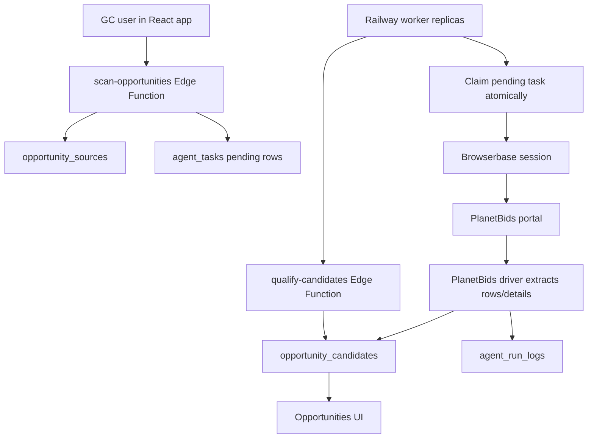

# BidBox Repository Audit - June 2026

Audit date: June 14, 2026  
Repository path: `/Users/bountycommand/repos/bidbox`  
Branch audited: `phase1-opportunity-intelligence`

This report is based on code and schema present in the repository. Where the product documentation says a capability exists but the implementation is incomplete, the implementation wins.

## Strategy Addendum

After this audit was created, the Opportunity Intelligence MVP strategy was clarified in `docs/initiatives/opportunity-intelligence-mvp.md`.

The current product strategy source of truth is:

```text
Opportunity Discovery
→ Human Interest Signal
→ Project Intelligence
→ Qualification
→ Add to Calendar
```

Where this audit describes scan-time auto-qualification, it should be read as current implementation state and preliminary metadata triage, not the final MVP qualification workflow. Final MVP qualification should occur after document-backed Project Intelligence, and the MVP pursuit signal is `Add to Calendar`.

## Executive Summary

BidBox is currently a working early-stage construction opportunity and bid-room product. It can authenticate GC users, let them manage projects, upload bid documents, publish public bid-room links, receive subcontractor bid uploads, maintain subcontractor directories, scan configured opportunity sources, queue PlanetBids scans to a Railway worker, and auto-classify discovered opportunities as Yes/Maybe/No using a GC qualification profile.

The current maturity level is a functional alpha moving toward a beta MVP. The best-built systems are the GC project/bid-room workflow, Supabase schema/RLS foundation, subcontractor directory basics, CSLB enrichment, and the new queue-based opportunity discovery architecture. The least mature systems are automated document collection/parsing, spec intelligence, agent orchestration beyond opportunity/qualification, non-PlanetBids source coverage, and production observability for stuck worker tasks.

Major completed systems:

- Authenticated GC app shell with project management.
- Public bid room by token with project file downloads and bid upload.
- Supabase storage buckets for project files and bid submissions.
- Trade type data model and project-trade mapping.
- Private GC subcontractor directory and public/network subcontractor tables.
- CSLB lookup/cache path using Firecrawl.
- Opportunity source table, candidate table, and Scan Now UI.
- `agent_tasks` queue table, `agent_run_logs`, and Railway worker for PlanetBids.
- PlanetBids driver using Browserbase and Playwright.
- Qualification profile UI and `qualify-candidates` edge function.
- Initial SoCal PlanetBids source expansion ledger with 76 configured sources.

Major unfinished systems:

- Automatic project document download from portals.
- Document storage model for discovered opportunities.
- OCR/PDF parsing/text chunking.
- AI extraction from plans/specs/addenda.
- Scope/trade/compliance/bond/insurance/labor extraction at scale.
- Robust stale-task recovery for worker crashes/hangs.
- Source verification for all 76 PlanetBids agencies.
- E2 source inventory for non-PlanetBids portals.
- E3 drivers for CaleProcure, Bonfire, OpenGov, Periscope/BidSync, DemandStar, and direct agency portals.
- Agent suite beyond basic Opportunity and Qualification agents.

Current user workflow:

1. GC signs in.
2. GC can create a project manually or convert a discovered opportunity into a project.
3. GC can upload bid documents and select required trades.
4. GC can copy a public bid-room link.
5. Subcontractors can open the public bid-room link, download files, and upload quote files.
6. GC can review received bid files.
7. Separately, GC can click Scan Now on Opportunities, which queues PlanetBids source tasks and watches worker progress through `agent_tasks`.
8. Discovered opportunities are auto-qualified against the GC's profile and can be triaged or converted.

The workflow breaks before true bid intelligence. BidBox can tell a GC "here are possible public jobs" and "here is a bid room," but it cannot yet reliably read all bid docs and answer "what trades, requirements, risks, and bid strategy are in this job?"

## System Architecture

### Frontend Architecture

The frontend is a Vite + React + TypeScript app using Tailwind, shadcn/Radix UI components, React Router, TanStack Query, Supabase JS, and Lucide icons.

Important routes in `src/App.tsx`:

- `/` and landing variants: marketing/landing surfaces.
- `/auth`: authentication.
- `/opportunities`: opportunity discovery and review.
- `/projects`: GC project dashboard.
- `/projects/new`: project creation and file upload.
- `/projects/:id`: project detail, files, bids, signals, readiness checklist.
- `/bid/:token`: public bid room.
- `/calendar`: bid calendar.
- `/settings`: account/subscription settings.
- `/settings/profile`: GC qualification profile.
- `/settings/subcontractors`: private subcontractor directory.
- `/subs-network`: searchable network subcontractor directory.
- `/admin/network-subs`: admin management for network subcontractors.
- `/admin/analytics`: admin analytics.

Frontend state is mostly local component state plus Supabase queries. Realtime is used on `/opportunities` for `opportunity_candidates` changes and `agent_tasks` inserts/updates.

### Backend Architecture

Backend logic is split across:

- Supabase Postgres tables.
- Supabase Edge Functions in `supabase/functions`.
- Supabase Storage buckets.
- A Railway-hosted Node worker in `bidbox-worker`.
- External services: Browserbase, Firecrawl, Lovable AI Gateway, Stripe.

The architecture is intentionally queue-based for opportunity scans. The browser-facing edge function queues tasks quickly; the Railway worker does slow portal scraping outside the Supabase edge timeout window.



### Supabase Usage

Supabase provides:

- Auth.
- Postgres data model.
- Row level security policies.
- Edge Functions.
- Realtime subscriptions.
- Storage for `project-files` and `bid-submissions`.

The Supabase project ID in `supabase/config.toml` is `ztuyjlyuzasbceepezua`.

### Edge Functions

Implemented functions:

- `scan-opportunities`: queues PlanetBids scans and runs non-PlanetBids drivers inline.
- `qualify-candidates`: evaluates pending opportunity candidates against GC profile.
- `crawl-project`: scrapes a project source URL with Firecrawl and uses Lovable AI Gateway to extract metadata.
- `recrawl-projects`: batch recrawls live projects with source URLs.
- `get-public-project`: returns public bid-room project data by token.
- `lookup-cslb`: looks up CSLB license info using Firecrawl and caches it.
- `cslb-ingest-master`: bulk ingestion path for network subcontractors.
- `cslb-verify-count`: verification/count helper for CSLB/network data.
- `create-checkout`: Stripe checkout.
- `stripe-webhook`: Stripe subscription lifecycle handling.

### Railway Worker

The worker in `bidbox-worker/index.js` processes `planetbids_scan` tasks:

- Selects the oldest pending task.
- Atomically updates it to `running`.
- Calls the PlanetBids scraper.
- Inserts candidates.
- Updates `opportunity_sources.last_scanned_at` on completion.
- Writes `agent_run_logs`.
- Marks `agent_tasks` as `completed` or `failed`.
- Calls `qualify-candidates` no more than once every 2 minutes per worker process.

The worker now loops immediately while tasks exist and sleeps 30 seconds only when no task is available. This improves throughput, but there is still no database-level lease/reaper that fails stale `running` tasks if a process dies or hangs.

### Browserbase Integration

Browserbase is used only by the Railway PlanetBids worker. The worker creates a Browserbase session through the Browserbase API, connects Playwright over CDP, opens the PlanetBids portal, and extracts rows and details. Required environment:

- `BROWSERBASE_API_KEY`
- Optional `BROWSERBASE_PROJECT_ID`

Known operational dependency: if Browserbase quota is exhausted, tasks fail before portal navigation. Recent code persists the error into `agent_tasks.error`, `agent_tasks.result.error_summary`, and `agent_run_logs.logs`.

### Firecrawl Integration

Firecrawl is used by:

- `crawl-project` for project source URL scraping.
- `lookup-cslb` because direct CSLB server-side fetches are blocked.
- `_shared/firecrawl_driver.ts` for generic opportunity discovery on non-PlanetBids sources.

Firecrawl is not currently used to fetch or parse project documents.

### AI Integrations

AI is used through Lovable AI Gateway:

- `crawl-project` uses `google/gemini-3-flash-preview` to extract project metadata from scraped page markdown.
- `_shared/firecrawl_driver.ts` uses `google/gemini-2.5-flash` for generic opportunity extraction.

The qualification engine is rule-based, not AI-based.

### Authentication

The frontend uses Supabase Auth. Project, file, bid, profile, and subcontractor data use RLS policies. Some public flows intentionally bypass user auth:

- `/bid/:token` uses `get-public-project`.
- Public bid submissions can upload to `bid-submissions`.

Edge function auth settings vary:

- `scan-opportunities`, `crawl-project`, and `create-checkout` require JWT.
- `qualify-candidates`, `recrawl-projects`, public project lookup, Stripe webhook, and CSLB helper functions do not require JWT per `supabase/config.toml`.

### Storage

Storage buckets:

- `project-files`: stores GC-uploaded project docs. Bucket was made public for public bid-room previews/downloads.
- `bid-submissions`: stores subcontractor quote uploads. Policies restrict GC access by project ownership.

No storage bucket or table is currently dedicated to automatically downloaded portal documents for opportunities.

## Database Audit

This section covers the major tables present in generated Supabase types and migrations.

### `profiles`

Purpose: User profile metadata for authenticated GCs.

Important fields:

- `id`: auth user ID.
- `email`
- `company_name`
- `estimating_email`
- `stripe_customer_id`
- `created_at`

Relationships: `profiles.id` corresponds to auth users and is used by projects, subscriptions, and role checks.

Usage status: Active. Used in settings, Stripe webhook, and public bid-room GC display.

### `projects`

Purpose: Core GC project records.

Important fields:

- `id`
- `gc_id`
- `name`
- `bid_due_at`
- `status`
- `public_token`
- `timezone`
- `source_url`
- `portal_type`
- `agency`
- `county`
- `scope_text`
- `last_crawled_at`
- `crawl_snapshot`
- `crawl_changes`
- `job_walk_exists`
- `job_walk_mandatory`
- `job_walk_at`
- `job_walk_details`
- `eligibility_restricted`
- `eligibility_notes`
- `documents_visible`
- `documents_accessible`
- `instructions`
- `is_ready_to_bid`

Relationships:

- `project_files.project_id`
- `bids.project_id`
- `project_trades.project_id`
- `project_bid_readiness.project_id`

Usage status: Active. This is the strongest product object in the app. It supports manual project creation, conversion from opportunities, bid-room publishing, recrawl metadata, file uploads, and readiness status.

### `project_files`

Purpose: Metadata for GC-uploaded project files.

Important fields:

- `project_id`
- `file_name`
- `file_url`
- `file_size`
- `uploaded_at`

Relationships: Belongs to `projects`.

Usage status: Active. Used by project detail and public bid room. Stores metadata only; file bytes are in `project-files` storage. It does not store parsed text, OCR, pages, spec sections, embeddings, or extracted requirements.

### `bids`

Purpose: Subcontractor bid submission metadata.

Important fields:

- `project_id`
- `submission_id`
- `file_name`
- `file_url`
- `bidder_name`
- `company_name`
- `email`
- `bid_item`
- `submitted_at`

Relationships: Belongs to `projects`. File bytes are in `bid-submissions`.

Usage status: Active. Public bid room inserts rows; project detail lists, downloads, and deletes submissions.

### `trade_types`

Purpose: Canonical trade/license classification table.

Important fields:

- `code`
- `name`
- `category`
- `state_code`
- `source`
- `is_default`
- `is_active`
- `parent_code`
- `notes`

Relationships:

- `project_trades.trade_type_id`
- `sub_trade_mappings.trade_type_id`
- `gc_sub_trade_mappings.trade_type_id`
- CSLB classification mapping in `lookup-cslb`.

Usage status: Active. Used for project trade selection, subcontractor matching, network search, and CSLB enrichment.

### `project_trades`

Purpose: Join table between projects and required trades.

Important fields:

- `project_id`
- `trade_type_id`

Relationships: Links `projects` to `trade_types`.

Usage status: Active. Used in New Project, Project Detail, Bid Room display, call list/bid list generation, and subcontractor matching. Current trade selection is manual; it is not yet extracted automatically from specs.

### `subcontractors`

Purpose: Shared/network subcontractor directory.

Important fields:

- `company_name`
- `license_number`
- `license_status`
- `license_expiration`
- `contact_name`
- `email`
- `phone`
- `city`
- `county`
- `state_code`
- `is_verified`
- `last_cslb_update`
- `notes`

Relationships:

- `sub_trade_mappings.sub_id`

Usage status: Active but partially productized. Admins can manage it. Users can search it in `/subs-network`. It is not yet tied into automated bid outreach.

### `sub_trade_mappings`

Purpose: Join table between network subcontractors and trade types.

Important fields:

- `sub_id`
- `trade_type_id`

Relationships: Links `subcontractors` to `trade_types`.

Usage status: Active for network search and exports.

### `gc_subcontractors`

Purpose: Private subcontractor directory per GC.

Important fields:

- `gc_id`
- `company_name`
- `license_number`
- `license_status`
- `license_expiration`
- `contact_name`
- `email`
- `phone`
- `city`
- `state_code`
- `notes`

Relationships:

- `gc_sub_trade_mappings.gc_sub_id`

Usage status: Active. Users can add/edit/delete/import private subs. The directory can be matched to required project trades.

### `gc_sub_trade_mappings`

Purpose: Join table between private GC subcontractors and trade types.

Important fields:

- `gc_sub_id`
- `trade_type_id`

Usage status: Active for private subcontractor matching.

### `cslb_cache`

Purpose: Cache CSLB license lookup results.

Important fields:

- `license_number`
- `company_name`
- `license_status`
- `expiration_date`
- `classifications`
- `city`
- `state_code`
- `fetched_at`
- `expires_at`

Usage status: Active. `lookup-cslb` checks cache before using Firecrawl. Cache TTL is 30 days in the function implementation.

### `subscriptions`

Purpose: Stripe subscription/payment state.

Important fields:

- `profile_id`
- `stripe_customer_id`
- `stripe_subscription_id`
- `status`
- `subscription_type`
- `valid_until`

Usage status: Active. Used by settings and project creation limit logic. The app appears to support a lifetime/single checkout flow and subscription status checks.

### `user_roles`

Purpose: Role-based authorization.

Important fields:

- `user_id`
- `role` enum: `admin`, `moderator`, `user`

Usage status: Active for admin network subcontractor access and admin analytics.

### `project_bid_readiness`

Purpose: Manual bid-readiness checklist per project.

Important fields:

- `project_id`
- `bond_required`
- `bond_delivery_method`
- `bond_online_submitted`
- `bond_in_person_delivered`
- `job_walk_mandatory`
- `job_walk_completed`
- `job_walk_attended_by`
- `addenda_issued`
- `addenda_reviewed`
- `proposal_prepared`
- `proposal_signed`
- `proposal_notarized`
- `bid_sheet_complete`

Usage status: Active. The checklist is manual. It does not currently auto-populate from parsed documents.

### `opportunity_sources`

Purpose: Source registry for opportunity scanning.

Important fields:

- `id`
- `name`
- `portal_type`
- `listing_url`
- `scan_enabled`
- `scan_interval_hours`
- `last_scanned_at`

Relationships:

- `opportunity_candidates.source_id`
- `agent_tasks.payload.source_id`

Usage status: Active. 76 SoCal PlanetBids sources are documented in `docs/opportunity-source-ledger.md`. Production verification is not fully complete per ledger status.

### `opportunity_candidates`

Purpose: Raw discovered opportunities before conversion into projects.

Important fields:

- `source_id`
- `source_url`
- `raw_title`
- `agency`
- `bid_due_at`
- `portal_type`
- `scope_text`
- `crawl_data`
- `status`
- `reviewed_by`
- `reviewed_at`
- `review_notes`
- `converted_project_id`
- `auto_status`
- `auto_status_reason`
- `qualification_score`
- `qualified_at`
- `last_crawled_at`

Relationships:

- Belongs to `opportunity_sources`.
- Can convert to `projects` through `converted_project_id`.

Usage status: Active. This table powers `/opportunities`. `crawl_data` is currently the flexible store for PlanetBids details such as `bid_id`, `estimated_value`, `county`, `commodity_codes`, `license_requirements`, and document manifest metadata.

### `gc_qualification_profiles`

Purpose: GC bid profile used by auto-qualification.

Important fields:

- `profile_id`
- `target_counties`
- `licenses_held`
- `naics_codes`
- `min_project_value`
- `max_project_value`

Usage status: Active. The UI allows editing counties, value range, license classes, and NAICS codes. Current candidate data often lacks the required license/NAICS fields needed to fully use the capability matching logic.

### `agent_runs`

Purpose: Legacy/source-level scan run records.

Important fields:

- `source_id`
- `status`
- `started_at`
- `completed_at`
- `candidates_found`
- `candidates_new`
- `error`

Usage status: Partially active for non-PlanetBids scans in `scan-opportunities`. PlanetBids now primarily uses `agent_tasks` and `agent_run_logs`.

### `agent_tasks`

Purpose: Shared queue for background agents/workers.

Important fields:

- `task_type`
- `status`
- `priority`
- `payload`
- `result`
- `error`
- `created_at`
- `started_at`
- `completed_at`
- `updated_at`

Usage status: Active and central to Scan Now. Current task statuses include `pending`, `running`, `completed`, `failed`, and references to `retrying` in frontend queries. The worker atomically claims pending PlanetBids tasks.

Known gap: no robust DB lease/reaper exists to recover stale `running` tasks if the worker process dies or hangs after claiming.

### `agent_run_logs`

Purpose: Diagnostic log table for worker task execution.

Important fields:

- `task_id`
- `status`
- `logs`
- `screenshots`
- `artifacts`
- `started_at`
- `completed_at`

Usage status: Active for the PlanetBids worker. Recent fixes added useful error persistence. Screenshots/artifacts are structurally supported but not meaningfully used by the current worker.

### `portal_drivers`

Purpose: Registry of supported portal driver types.

Important fields:

- `portal_type`
- `driver_name`
- `driver_mode`
- `enabled`

Usage status: Present and seeded for driver routing. Actual production PlanetBids scanning is handled by the Railway worker, not this table alone.

## Opportunity Discovery System

### Current Workflow

1. User opens `/opportunities`.
2. Frontend loads `opportunity_candidates` joined to `opportunity_sources`.
3. User clicks Scan Now.
4. Frontend invokes `scan-opportunities` and records the request start time.
5. `scan-opportunities` loads enabled `opportunity_sources`.
6. For a full scan, it filters sources whose `last_scanned_at` is null or more than 1 hour old.
7. Sources are split into PlanetBids and non-PlanetBids.
8. PlanetBids sources are bulk-queued into `agent_tasks` as `pending` rows with payload fields like `source_id`, `source_name`, `listing_url`, and `portal_type`.
9. The response returns queue-oriented metrics including `total_queued`, `queued_task_ids`, and `queued_tasks`.
10. The frontend uses those IDs and realtime `agent_tasks` subscriptions to show active scan progress.
11. Railway worker replicas poll/claim pending `planetbids_scan` tasks.
12. Worker marks each task `running`.
13. Worker creates an `agent_run_logs` row.
14. Worker launches Browserbase/Playwright and runs the PlanetBids driver.
15. Extracted candidates are inserted into `opportunity_candidates`.
16. Worker updates `opportunity_sources.last_scanned_at`.
17. Worker marks task `completed` or `failed` and stores result/error details.
18. Worker periodically calls `qualify-candidates`.
19. Qualification updates `auto_status`, `auto_status_reason`, `qualification_score`, and `qualified_at`.
20. `/opportunities` updates through realtime and manual reloads.

### Actual Implementation Notes

- PlanetBids is asynchronous and queue-based.
- Non-PlanetBids scans still run inline in `scan-opportunities` using `runDriver`.
- `scan-opportunities` intentionally does not update `last_scanned_at` at queue time. It updates after work completes through the worker, avoiding false freshness.
- Duplicate active task prevention is implemented by checking `agent_tasks` with active statuses before bulk insert.
- The frontend progress panel relies on task rows, not on final candidate counts.
- Current scan result counts can still feel misleading if no candidates are inserted, but the backend response now exposes queue state.

## Driver System Audit

### Driver Router

Location: `supabase/functions/_shared/driver_router.ts`

Supported routing:

- `firecrawl` -> Firecrawl driver.
- `planetbids` -> Deno PlanetBids driver in `_shared`.
- Unknown portal -> no driver.

Production reality: PlanetBids production scans are currently queued to Railway and use `bidbox-worker/drivers/planetbids.js`. The Deno `_shared/planetbids_driver.ts` appears to be older infrastructure and is not the main path for Scan Now.

### PlanetBids Driver - Railway Worker

Location: `bidbox-worker/drivers/planetbids.js`

Supported portal: PlanetBids.

Status: Active production path, but still fragile and recently under active repair.

Production readiness: Early beta. It can extract real candidates, but source-by-source reliability must still be verified.

Data captured:

- `raw_title`
- `agency`
- `bid_due_at`
- `source_url`
- `portal_type`
- `source_id`
- `bid_id`
- `estimated_value`
- `estimated_value_raw`
- `estimated_value_low`
- `estimated_value_high`
- `license_requirements`
- `county`
- `commodity_codes`
- `scope_text`
- `documents` manifest metadata when available
- `scraped_at`

Core mechanics:

- Creates Browserbase session.
- Connects Playwright over CDP.
- Navigates to listing URL.
- Waits for PlanetBids bid API and row rendering.
- Falls back through table/grid selectors.
- Filters rows to active bidding rows.
- Reopens listing page for each row index.
- Clicks row into detail page.
- Extracts body text and DOM fields.
- Parses estimates, due dates, bid ID, license requirements, county, commodity codes, and document manifests.
- Keeps construction-related opportunities based on 91xxx commodity codes when commodity codes are present.

Known weaknesses:

- Browser automation is inherently brittle. Row rendering, SPA navigation, iframes, and empty listings can fail.
- The driver depends on Browserbase quota and session stability.
- Detail-page row click navigation can timeout.
- It captures document manifest metadata but does not download documents.
- It does not guarantee scope completeness because many PlanetBids details are hidden behind tabs, APIs, or login-gated documents.
- The worker has no hard global task lease/reaper, so a claimed task can remain `running` if the worker hangs after claim.
- Source verification is incomplete across all 76 seeded sources.

### PlanetBids Driver - Deno Shared Version

Location: `supabase/functions/_shared/planetbids_driver.ts`

Supported portal: PlanetBids.

Status: Present but likely not current production path for Scan Now.

Production readiness: Lower confidence than the Railway worker driver because current architecture queues PlanetBids work to Railway.

Data captured: Similar candidate fields, but code parity with the worker driver is uncertain.

Recommendation: Treat this as legacy or secondary until intentionally reconciled with the worker driver.

### Firecrawl Driver

Location: `supabase/functions/_shared/firecrawl_driver.ts`

Supported portal: Generic web pages and older PlanetBids-like scraping path.

Status: Implemented, but not the core current PlanetBids path.

Production readiness: Experimental for opportunity discovery.

Data captured:

- Title
- Agency
- Due date
- Source URL
- Scope text
- Portal type
- Crawl metadata

Mechanics:

- Uses Firecrawl to scrape pages.
- Uses Lovable AI Gateway/Gemini to extract structured opportunities.

Known weaknesses:

- Generic extraction has lower determinism than portal-specific drivers.
- It runs inline in `scan-opportunities`, making edge timeout risk higher for many sources.
- It is not yet the foundation for E2/E3 portal expansion.

### Missing Drivers

Not implemented as production drivers:

- CaleProcure.
- Bonfire.
- OpenGov.
- Periscope/BidSync.
- DemandStar.
- BuildingConnected.
- LA County direct.
- LADWP direct.
- LACMTA direct.
- Other agency-direct portals.

## Qualification Agent Audit

### Workflow

`qualify-candidates` accepts a request, resolves a profile ID either from the request body or authenticated user, loads the GC's `gc_qualification_profiles` row, loads pending `opportunity_candidates`, evaluates each candidate, and updates qualification fields.

Updated fields:

- `auto_status`: `green`, `yellow`, or `red`.
- `auto_status_reason`
- `qualification_score`
- `qualified_at`

It does not change the manual review `status` field.

### Scoring Logic

The evaluator starts at score 50 and adjusts:

- County match can add points.
- Value inside range can add points.
- Unknown/weak data produces yellow flags.
- Hard disqualifiers produce red.

The exact score is less important than the status. The UI primarily surfaces Yes/Maybe/No.

### Green/Yellow/Red Logic

Red hard stops:

- Bid due date is in the past.
- County is known and outside target counties.
- Estimated value is below min value.
- Estimated value is above max value.
- Required licenses/NAICS exist and do not match the profile.

Yellow caution states:

- County unknown.
- Estimated value unknown.
- Bid due soon.
- Scope text missing or too short.

Green:

- No red hard stop.
- No yellow caution flags.
- Data is sufficiently aligned with profile.

### Profile Matching

Profile fields:

- `target_counties`
- `licenses_held`
- `naics_codes`
- `min_project_value`
- `max_project_value`

County detection currently uses `crawl_data.county` first. If missing, it falls back to a hardcoded agency-to-county map. That map appears to cover only the original small source set, not all 76 SoCal sources.

### Construction Relevance Logic

Construction relevance is stronger in the PlanetBids worker than in `qualify-candidates`.

The worker uses commodity codes when available and keeps 91xxx construction-related items. If commodity codes are absent, it keeps the candidate rather than rejecting it. Qualification itself does not perform deep construction-scope classification beyond sparse scope text and capability fields.

### Value Logic

The qualifier reads:

1. `crawl_data.estimated_value` if present and positive.
2. A fallback dollar amount parsed from `raw_title`.

This is now wired to the PlanetBids detail extraction path, but fill rate depends on whether agencies publish estimate fields and whether the driver recognizes their markup.

### Limitations

- Scope text is often too thin for high-confidence bid/no-bid decisions.
- Required licenses and NAICS requirements are rarely populated.
- County fallback is stale for the expanded source list.
- No document-level reading means bond, insurance, labor compliance, prequalification, and special conditions are mostly unknown.
- The worker calls qualification with a hardcoded profile ID in code. That is acceptable for a single beta account but not multi-tenant production.

## Opportunity Data Model Audit

### Data Currently Available for a Candidate

From `opportunity_candidates` and `crawl_data`, an opportunity can currently have:

- Title.
- Agency.
- Portal type.
- Source URL/detail URL.
- Bid due date.
- Source ID.
- Scan status and review status.
- Auto qualification status/reason/score.
- Estimated value when extracted.
- Bid ID when extracted.
- County when extracted or inferred.
- Commodity codes when extracted.
- License requirement strings when extracted.
- Scope text when extracted.
- Document manifest metadata when available.
- Crawl timestamp.

### Critical Data Missing or Unreliable

Critical gaps:

- Full project scope from specifications.
- Trade breakdown.
- CSI divisions.
- Required licenses by trade.
- Required NAICS/SBE/DVBE/DBE rules.
- Bid bond/payment bond/performance bond requirements.
- Insurance requirements.
- Prevailing wage/labor compliance requirements.
- Mandatory pre-bid/job walk details from documents.
- Addenda list and addenda delta tracking.
- Plan/spec document files.
- Parsed document text.
- Bid form requirements.
- Proposal checklist generated from documents.
- Self-perform fit.
- Subcontractor coverage needs.
- Estimate complexity/risk.

### Effectiveness of Current Qualification

Current qualification is useful as a coarse triage layer:

- "Is it open?"
- "Is it in my county?"
- "Is it around my target value?"
- "Does the title/sparse scope look plausible?"

It is not yet sufficient for a contractor to confidently decide whether to chase a job without opening the portal/documents. The product can reduce portal hunting, but it cannot yet replace manual bid package review.

## Document Processing Readiness

### What Already Exists

Implemented:

- Manual GC upload of project files to `project-files`.
- Public bid room file downloads.
- Public bid file submissions to `bid-submissions`.
- Basic file validation for public bid upload.
- File preview component for uploaded project files.
- PlanetBids document manifest metadata capture in candidate `crawl_data.documents` when the worker can obtain it.
- `crawl-project` metadata extraction from a source webpage.

### What Is Partially Implemented

Partial:

- `crawl-project` can extract metadata such as bid due date, job walk, eligibility, document visibility/accessibility, engineer's estimate, bonds, and addenda from scraped page text. This is webpage metadata extraction, not full document intelligence.
- `HighSignalPanel` can display extracted engineer estimate, bond requirements, and addenda from `crawl_snapshot.semantic`, but only if `crawl-project` found them in page markdown.
- `ProjectSignals` surfaces job walk, gated docs, eligibility, and recrawl staleness.
- The PlanetBids worker may know documents exist, but it stops at metadata.

### What Is Completely Missing

Missing:

- Automatic download of portal documents.
- A durable table for opportunity/project document ingestion state.
- Document de-duplication/versioning.
- OCR pipeline for scanned PDFs.
- PDF/DOCX/XLSX text extraction.
- Chunking and indexing.
- Embeddings/vector search.
- Spec section parser.
- Plan sheet parser.
- Addenda document diffing.
- AI extraction from downloaded documents.
- Human review queue for uncertain extracted requirements.

### Can BidBox Automatically Collect and Process Project Documents at Scale?

No. BidBox cannot currently collect and process project documents at scale.

It can store manually uploaded documents and can sometimes detect/list source documents. It does not automatically download portal documents, store them as source artifacts, parse their text, run OCR, or extract requirements from them. This is the biggest gap between the current product and a true bid-intelligence agent platform.

Required components:

1. `opportunity_documents` or generalized `documents` table.
2. Storage bucket/path convention for source documents.
3. Portal document downloader per driver.
4. Document fetch authorization/session handling.
5. File type detection.
6. Text extraction for PDFs, DOCX, XLSX, ZIP contents.
7. OCR fallback.
8. Chunk storage and extraction status.
9. AI requirement extraction jobs.
10. Addenda/version monitoring.
11. UI to show extracted facts with source citations.

## Agent Readiness Assessment

### Opportunity Agent

Current status: Partially implemented and active.

Existing infrastructure:

- `opportunity_sources`
- `opportunity_candidates`
- `agent_tasks`
- `agent_run_logs`
- Railway worker
- PlanetBids driver
- Scan Now UI

Effort remaining: Medium.

Dependencies:

- Source verification.
- Stale task recovery.
- More drivers.
- Better per-source diagnostics.
- Document download support.

### Qualification Agent

Current status: Partially implemented and active.

Existing infrastructure:

- `gc_qualification_profiles`
- `qualify-candidates`
- Auto Yes/Maybe/No fields.
- Qualification profile UI.

Effort remaining: Medium.

Dependencies:

- More complete candidate data.
- County/source metadata.
- License/trade extraction.
- Multi-tenant profile invocation fix for worker-triggered qualification.

### Spec Agent

Current status: Not implemented.

Existing infrastructure:

- Manual file storage.
- Some page-level metadata extraction.

Effort remaining: High.

Dependencies:

- Document ingestion.
- PDF/OCR/text extraction.
- Spec section parsing.
- Citations.

### Scope Agent

Current status: Not implemented beyond basic `scope_text`.

Existing infrastructure:

- `scope_text` fields on projects/candidates.
- AI page-level extraction in `crawl-project`.

Effort remaining: High.

Dependencies:

- Document text.
- Trade/scope extraction prompts.
- Review UI.

### Subcontractor Agent

Current status: Partially implemented as data and matching utilities, not as an agent.

Existing infrastructure:

- Private GC subcontractors.
- Network subcontractors.
- Trade mappings.
- CSLB enrichment.
- Bid/call list utilities.

Effort remaining: Medium.

Dependencies:

- Reliable project trade extraction.
- Outreach workflow.
- Email/SMS integration.
- Response tracking.

### Coverage Agent

Current status: Not implemented as an agent.

Existing infrastructure:

- `bids` table.
- Project trades.
- Subcontractor directories.

Effort remaining: Medium.

Dependencies:

- Trade requirements per project.
- Bid submissions mapped to trades.
- Coverage dashboard.

### Compliance Agent

Current status: Not implemented.

Existing infrastructure:

- Manual readiness checklist.
- Some eligibility fields.
- CSLB license data for subs.

Effort remaining: High.

Dependencies:

- Spec/document extraction.
- Labor/compliance parser.
- Bond/insurance/license requirement parser.

### Addenda Agent

Current status: Not implemented beyond page-level addenda extraction in `crawl-project`.

Existing infrastructure:

- `crawl_snapshot.semantic.addenda`.
- `crawl_changes` for recrawled projects.
- `recrawl-projects`.

Effort remaining: High.

Dependencies:

- Document download/versioning.
- Addenda detection.
- Diffing and notification.

### Estimating Agent

Current status: Not implemented.

Existing infrastructure:

- Estimated value fields.
- Project files.
- Scope text.

Effort remaining: Very high.

Dependencies:

- Structured scope quantities.
- Plans/spec parsing.
- Historical pricing or cost model.
- Estimator workflow design.

### Proposal Agent

Current status: Not implemented.

Existing infrastructure:

- Manual readiness checklist.
- Bid room and submitted files.

Effort remaining: High.

Dependencies:

- Bid form extraction.
- Proposal requirements extraction.
- Document generation.
- Approval workflow.

### Knowledge Agent

Current status: Not implemented.

Existing infrastructure:

- Crawl snapshots.
- Uploaded file metadata.

Effort remaining: High.

Dependencies:

- Document corpus.
- Search/indexing.
- Citations.
- Question answering UI.

## Current User Journey

### What a User Can Do Today

A GC can:

- Create an account and sign in.
- Create projects manually.
- Convert discovered opportunities into projects.
- Upload project files.
- Select required trades manually.
- Add project instructions.
- Copy a public bid-room link.
- Let subcontractors download project files.
- Let subcontractors upload quote files.
- View, download, and delete bid submissions.
- Track bid due dates and job walk dates on a calendar.
- Use a manual bid-readiness checklist.
- Create a qualification profile.
- Click Scan Now and queue PlanetBids source scans.
- Review discovered opportunities as Yes/Maybe/No.
- See estimated values on opportunity cards when extracted.
- Manage a private subcontractor directory.
- Search a network subcontractor directory.
- Use CSLB lookup/enrichment for subcontractor data.

### What a User Cannot Do Today

A GC cannot reliably:

- Automatically download all bid documents from source portals.
- Automatically parse plans/specs.
- Ask questions across project documents.
- Get a complete trade/scope breakdown.
- Get complete bond/insurance/labor/compliance requirements.
- Get addenda monitoring with document diffs.
- Get reliable bid/no-bid recommendations from full document evidence.
- Automatically generate a proposal.
- Automatically estimate.
- Automatically contact subs and track coverage.
- Rely on non-PlanetBids portal coverage.

### Workflow from Finding an Opportunity to Submitting a Bid

Current path:

1. Scan sources.
2. Review candidate cards.
3. Convert a candidate to project.
4. Manually upload/attach bid docs if needed.
5. Manually select required trades.
6. Share public bid room.
7. Collect subcontractor bid uploads.
8. Manually review bids.
9. Manually complete readiness checklist.
10. Prepare and submit final bid outside BidBox.

Break points:

- Between scan and project creation: candidate data may be incomplete or stale.
- Between project creation and bid package review: documents are not automatically retrieved/parsed.
- Between docs and scope/trades: trade requirements are manual.
- Between trades and coverage: outreach/coverage is not automated.
- Between coverage and final bid: estimating/proposal submission is outside the app.

## MVP Gap Analysis

MVP target problems:

1. "I don't know what to bid."
2. "I waste hours digging through portals."
3. "I don't know if this job is worth chasing."

### Must-Have Systems

For a 1-5 contractor beta, must-have means "enough to create obvious weekly value," not full automation.

Must-have:

- Reliable source scanning for a focused geography and portal set.
- Verified opportunity source ledger.
- Clear scan progress and failure states.
- No stale `running` tasks blocking user trust.
- Candidate cards with agency, due date, title, link, estimated value when available.
- Hard rejection of closed/expired opportunities.
- GC qualification profile.
- Explainable Yes/Maybe/No reasons.
- Basic source opening/conversion to project.
- Manual user feedback buttons: correct/incorrect, interested/not interested.
- Daily or on-demand list of relevant opportunities.

### Nice-to-Have Systems

Nice-to-have for MVP:

- Automatic document manifest display.
- One-click source document download for the user, even before full parsing.
- Better scope summaries.
- Email digest.
- Saved filters by county/value/agency.
- More worker replicas or concurrency tuning.
- Non-PlanetBids source inventory.
- Private subcontractor matching.
- Bid-room workflow improvements.

### Unnecessary Systems for MVP

Not required to validate the first business wedge:

- Estimating agent.
- Proposal agent.
- Full subcontractor outreach automation.
- Full coverage agent.
- Complete spec intelligence.
- Full addenda diffing.
- Multi-portal nationwide coverage.
- Complex admin analytics.
- Sophisticated subscription enforcement.

### Shortest Path to Beta Validation

The shortest path is not to build the entire agent architecture. It is:

1. Pick 1-2 contractor profiles and 3-5 counties.
2. Verify the source ledger for those counties.
3. Run scans daily.
4. Deliver a clean list of open, relevant projects with links, due dates, agencies, value if available, and why BidBox thinks each is worth/not worth chasing.
5. Track contractor feedback on whether each opportunity was relevant and whether they would have found it manually.
6. Manually supplement missing document/context data during beta if needed.

If beta contractors say "this found jobs I would have missed" or "this saved portal-checking time," the product has validated the wedge before full document AI exists.

## Recommended Next Build Sequence

These priorities optimize for customer learning and beta readiness, not architectural completeness.

1. Add worker stale-task protection.
   - Add an outer task timeout, stale `running` reaper, and UI stale state. This protects user trust in Scan Now.

2. Production-verify the 76 PlanetBids sources.
   - Update `docs/opportunity-source-ledger.md` with scan success, candidate yield, empty/no-bid status, and broken portal notes.

3. Fix county/source metadata for qualification.
   - Store county/region on `opportunity_sources` or reliably in `crawl_data`, then remove reliance on the stale hardcoded agency map.

4. Build a source-quality dashboard/query.
   - Track per source: queued, completed, failed, candidates found, candidates new, last error, last successful scan.

5. Improve PlanetBids document handling to at least show document manifests clearly.
   - Display known docs on candidate/project pages even before automatic download.

6. Add automatic document download for PlanetBids where session/API access allows.
   - Store files in a new source-document storage path and record metadata in a new table.

7. Build minimal document text extraction for downloaded PDFs.
   - Start with text-native PDFs. Add OCR later.

8. Add MVP bid/no-bid extraction fields with citations.
   - Scope summary, trades, license, bid bond, job walk, addenda count, insurance/labor red flags.

9. Add beta feedback capture on opportunity cards.
   - "Relevant?", "Would bid?", "Already knew?", "Bad match reason." This validates the business fastest.

10. Do E2 source mapping only for beta-relevant agencies.
   - Do not boil the ocean. Inventory non-PlanetBids portals for the exact counties/agencies beta users care about, then build the next driver based on observed demand.

## Final Assessment

BidBox has crossed from mockup into a real working product foundation. The strongest MVP wedge is opportunity discovery and triage for public works GCs. The queue architecture is the right shape, the PlanetBids path is real, and the frontend has enough workflow to support beta users.

The biggest risk is overclaiming agent intelligence before document ingestion exists. The product can currently reduce portal-hunting pain, but it cannot yet deeply understand bid packages. The next build cycle should harden scan reliability, verify source coverage, improve qualification data quality, and collect beta feedback before investing heavily in advanced agents.
